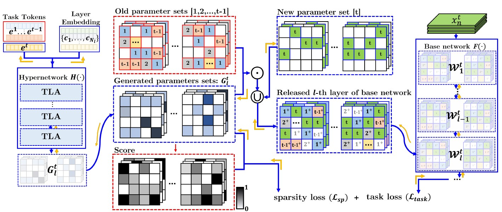

# Growing a Brain with Sparsity-Inducing Generation for Continual Learning
This repos contains code for continually training video action recognition task from our Growing a Brain with Sparsity-Inducing Generation for Continual Learning (ICCV 2023).
Please see our paper for more detailed information.
<div align="center">
  

[](https://pytorch.org/)


</div>


## Requirements 
TBD 

## Run the code
This repository supports the video action recognition experiment with UCF-101 in the original paper.

```bash
python3 TBD
```

We followed the video action recognition benchmark provided from [[vCLIMB]](https://github.com/ojedaf/vCLIMB_Benchmark).
Each video is split into three segments of equal duration. 
In each segment, a frame is selected randomly. 

## Citation
